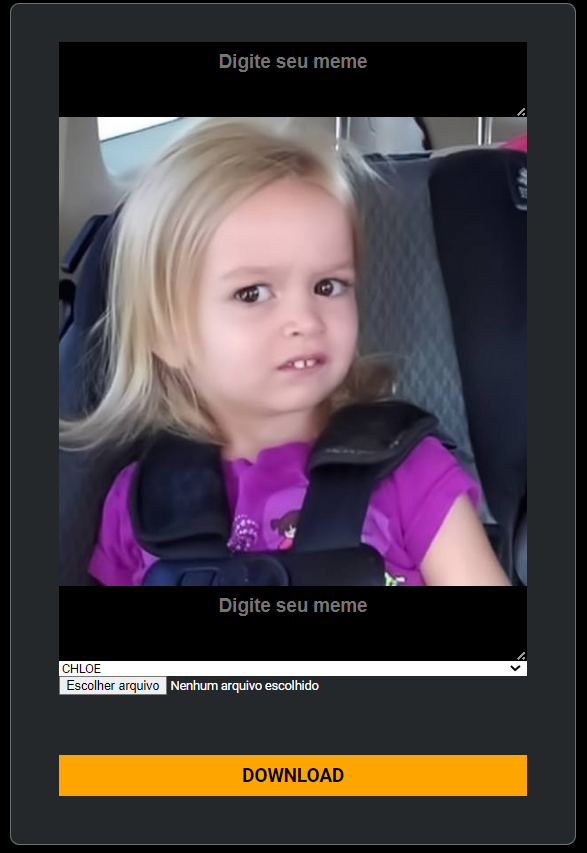

<h1 align="center"> MÁQUINA DE MEMES</h1>

Projeto desenvolvido em uma Live da DIO,
aonde aperfeiçoei-me em conceitos de estilos do css, aonde consigo ter um ponto inicial para começar seja fazendo um layout no figma ou simplismente desenhando.

 
 

 

## 🚀 Tecnologias

Esse projeto foi desenvolvido com as seguintes tecnologias:

- HTML 
- CSS
- JavaScript

 

## 💻 Projeto

A Máquina de Memes é uma plataforma web que possibilita a produção personalizada de memes e disponibiliza para download 🖨️.
